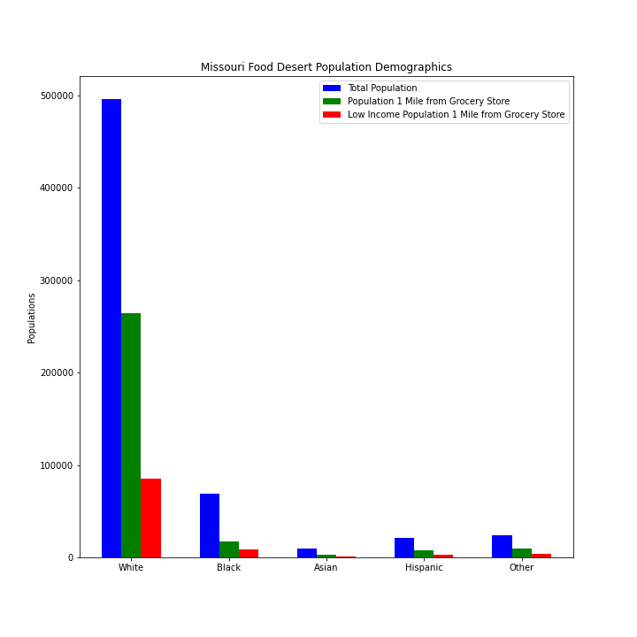

# Project One: Food Deserts and Food Environments 
##### Mary Bellavia, David Fournie, Janelle Goddard, and Eric Evans
##### 12/23/2020

### Question One: What are the demographics for food deserts in Missouri?
The racial demographics analysis of the data on the overall population, the low access population, and the low access low income population for Missouri yielded some concrete numbers. The bar graph and total population percentages pie chart show the white population in the largest population in Missouri. 

The last bar chart shows the percentages for the populations who live in low access areas by race and who live in low access low income tracts by race. This bar chart shows that a greater percentage of the white population is affected by low access to grocery stores. In addition, those in the black, hispanic, or other population, if they live in a low access area are far more likely to also be affected by low income. This bar graph shows that food deserts disproportionately affects black, hispanic, and multiracial or other populations in Missouri.

### Question Two: What is the relationship between the poverty rate for a given county in Missouri and low access populations?

### Question Three: What is the food environment for the counties that comprise Missouri’s two largest cities, St. Louis and Kansas City?
After looking over the data, we decided to break the two largest cities in Missouri down into their 4 largest counties. We are now able to see what types of food environments make up the majority of each county and how this relates to the food desert. In our first bar chart, we compared total supermarkets to just standard fast food restaurants. As you can see, the amount of fast food restaurants nearly doubles the amount of supermarkets in every county. Our second bar chart, breaks down the percentage of convenience stores, fast food restaurants, full service restaurants, and supermarkets. This chart also showing that supermarkets makes up a small percentage of each county versus the percentages of fast food and full service restaurants. Although each county has plenty of food options available there is still a lack of supermarkets available based on our data provided. All the other options of fast food and full services restaurants aren't necessarily the healthiest of options, and individuals with lower income could have a difficult time purchasing food from these types of restaurants on regular basis.

### Definition of Terms
from the United States Department of Agriculture Economic Research Service and Census Bureau
* Food Desert: “[A] food desert [is] a low-income census tract where a substantial number or share of residents has low access to a supermarket or large grocery store.”
What does low access mean?
* Low Access: “[Living] more than 1 mile from a supermarket or large grocery store in urban areas and as more than 10 miles from a supermarket or large grocery store in rural areas.”
How is low income determined?
* Low Income: “[T]he poverty rate for that tract is at least 20 percent”
How is the poverty rate determined? :
* Poverty Rate: “[A] family's total income is less than the family's threshold, then that family and every individual in it is considered in poverty”	

### Sources
* https://www.ers.usda.gov/data-products/food-access-research-atlas/download-the-data/
* https://www.census.gov/topics/income-poverty/poverty/guidance/poverty-measures.html 

Create a write-up summarizing your major findings. This should include a heading for each "question" you asked of your data, and under each heading, a short description of what you found and any relevant plots.